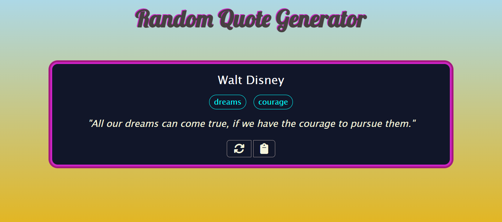

# Random Quote Generator

[]()
[]()
[]()
[]()
[)]()


## Descripción :memo:
**Random Quote Generator** es una aplicación web interactiva que te permite descubrir citas inspiradoras de personajes famosos de forma aleatoria. Con una interfaz atractiva 
y fácil de usar, esta aplicación es perfecta para encontrar motivación, inspiración o simplemente disfrutar de la sabiduría de grandes mentes.

Las principales funcionalidades incluyen:

* **Generación Aleatoria de Citas:** Descubre citas nuevas con solo un clic.
* **Interfaz Atractiva:** Diseño moderno y fácil de usar.
* **Información del Autor:** Conoce al autor de cada cita.
* **Palabras Clave:** Explora temas relacionados con cada cita.
* **Funcionalidades Adicionales:**
  - Copia citas al portapapeles.
  - Refresca para una nueva cita.


## Tecnologías Utilizadas :computer:

Este proyecto ha sido desarrollado utilizando las siguientes tecnologías:

* **HTML:** Para la estructura y el contenido de la aplicación.
* **Sass:** Para el estilizado y la apariencia visual, utilizando preprocesamiento CSS.
* **Vite:** Como herramienta de construcción y servidor de desarrollo para una experiencia de desarrollo rápida y eficiente.
* **JavaScript:** Para la lógica y la interactividad de la aplicación.
* **API de citas:** Origen de las citas mostradas en la aplicación.

## Vista previa del diseño :clipboard:

  <div align="center">
    
    
    Pantalla principal mostrando una de las citas obtenidas aleatoriamente.
  </div>
  

## Instalación y Uso 👈


Para ejecutar este proyecto localmente, sigue estos pasos:

1.  **Clona el repositorio:**
    ```bash
    git clone <URL_DE_TU_REPOSITORIO>
    cd <NOMBRE_DE_TU_REPOSITORIO>
    ```

2.  **Instala las dependencias:**
    ```bash
    npm install
    ```
    o
    ```bash
    yarn install
    ```

3.  **Ejecuta la aplicación:**
    ```bash
    npm run dev
    ```
    o
    ```bash
    yarn dev
    ```

4.  **Abre tu navegador:** La aplicación estará disponible en la dirección que se muestre en la consola (generalmente `http://localhost:5173/` o similar).

## Contribución  :information_desk_person:

Si te gustaría contribuir a este proyecto, ¡tus aportaciones son bienvenidas! Puedes:

* Reportar errores o sugerir nuevas funcionalidades.
* Enviar pull requests con mejoras o correcciones.

## Contacto 📫

Si tienes alguna pregunta o sugerencia, no dudes en contactarme.

Email: danielribes.valencia@gmail.com

---

**¡Gracias por revisar mi proyecto!**
